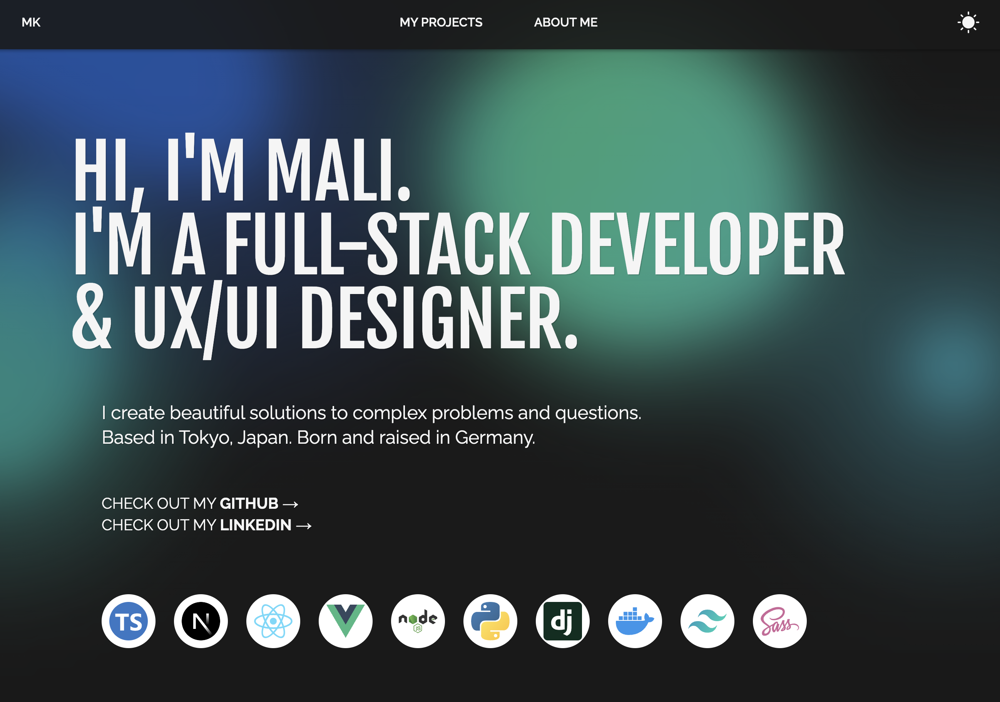
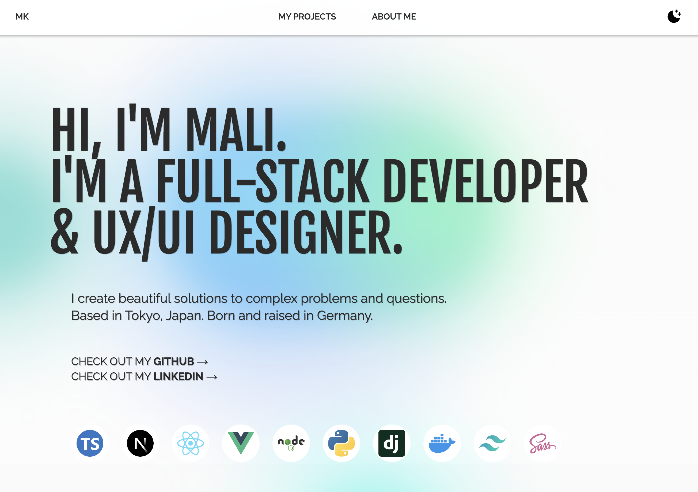

# Portfolio 2023

This project was built using Next.js, Sass, and Tailwind CSS, and it is deployed with Vercel.

## Live Demo

[View the live portfolio](https://maliklein.vercel.app/)

## Screenshots

## Technologies Used

- [Next.js](https://nextjs.org/)
- [Sass](https://sass-lang.com/)
- [Tailwind CSS](https://tailwindcss.com/)
- [Vercel](https://vercel.com/)
